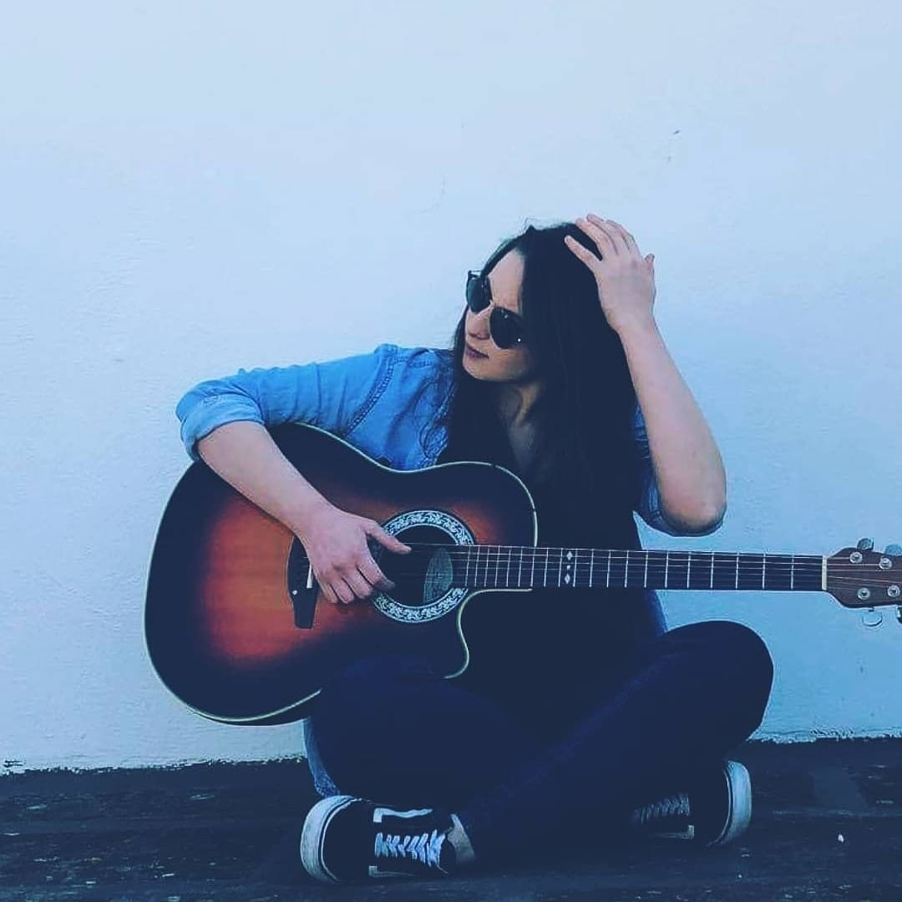
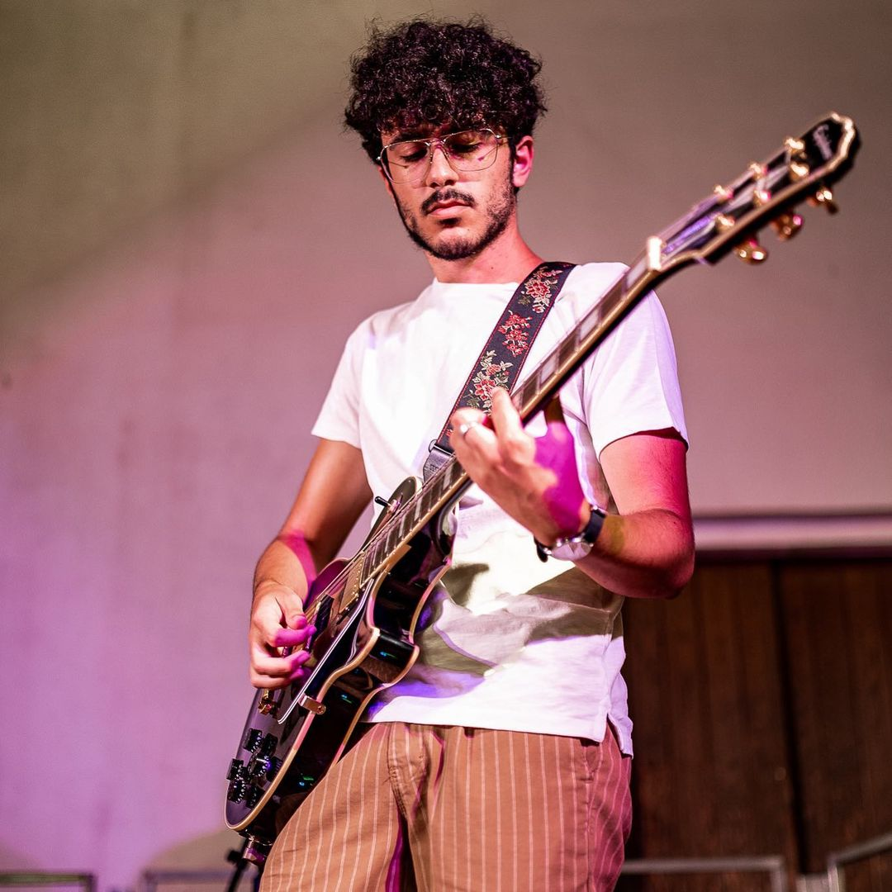
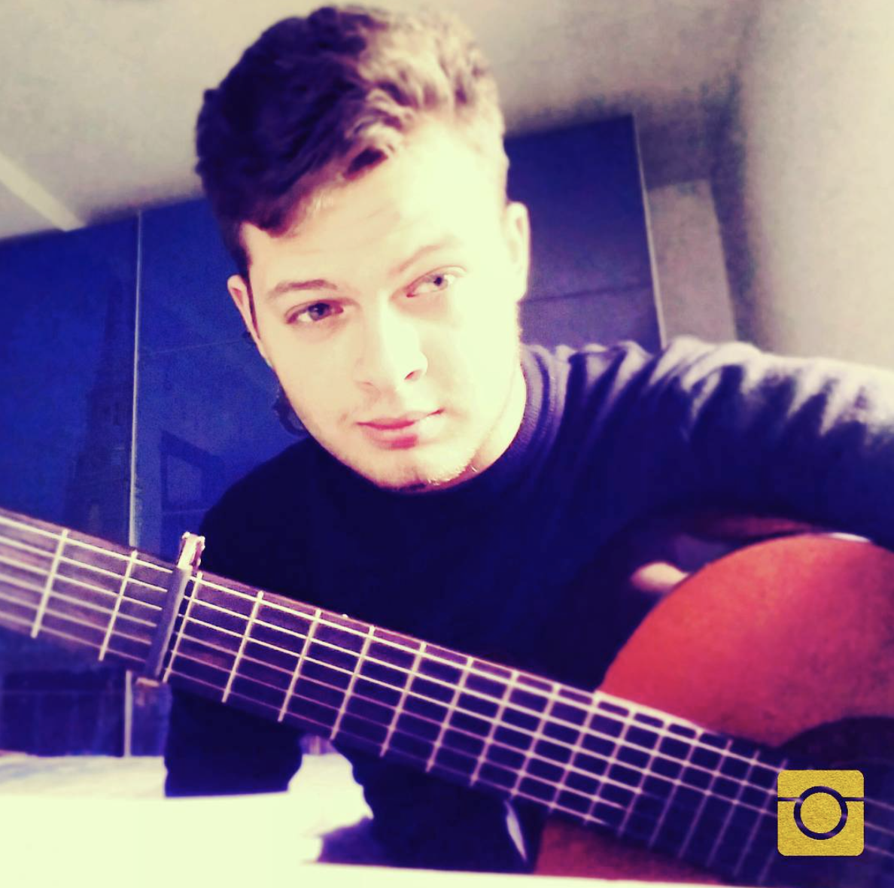
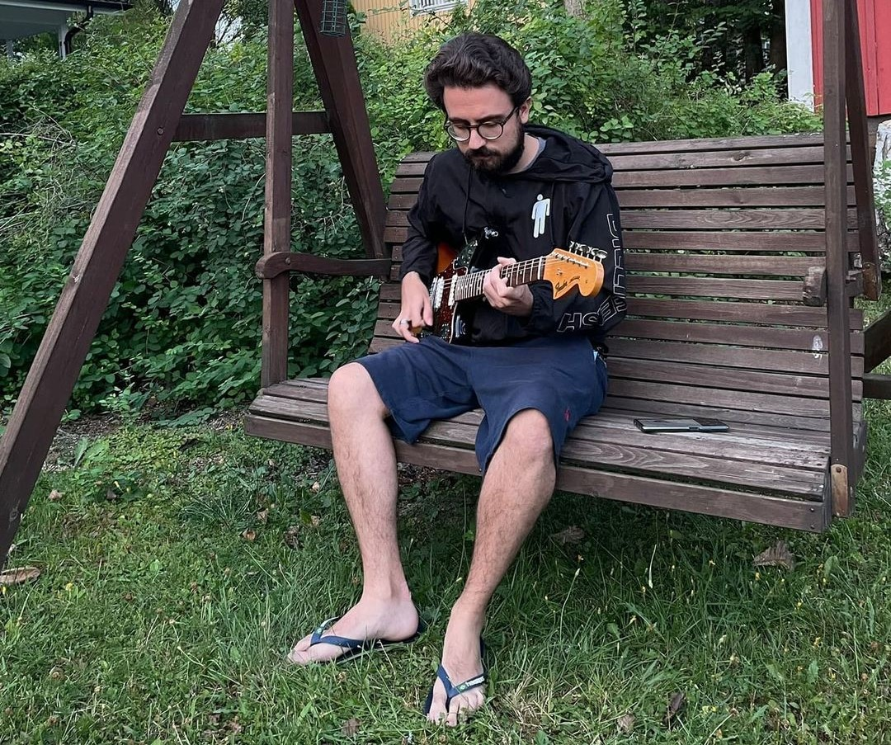
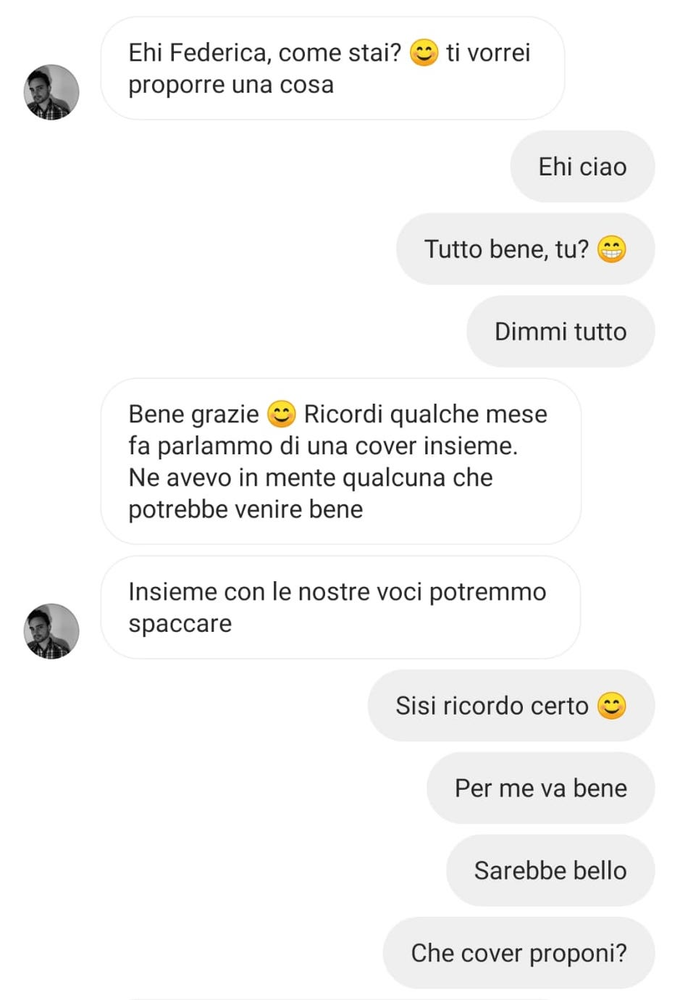
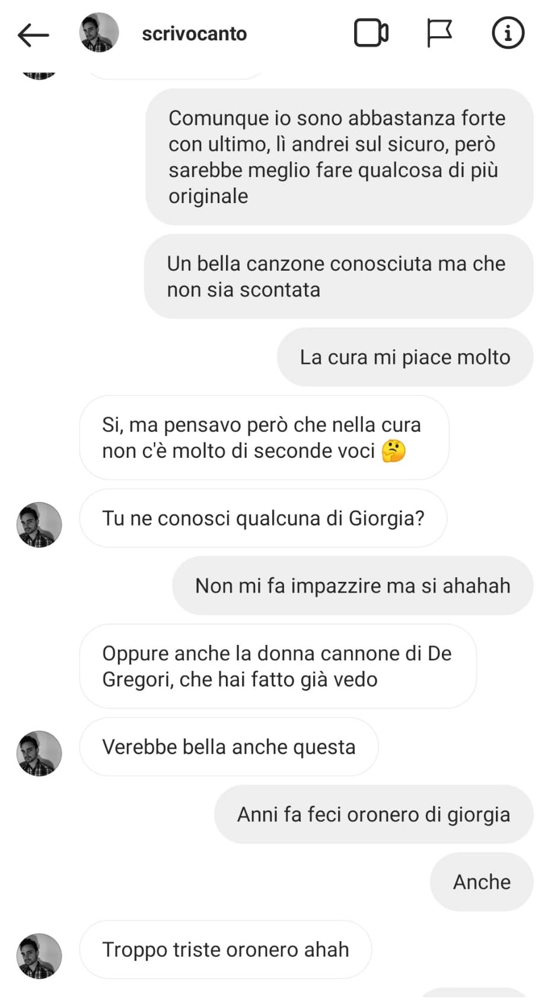
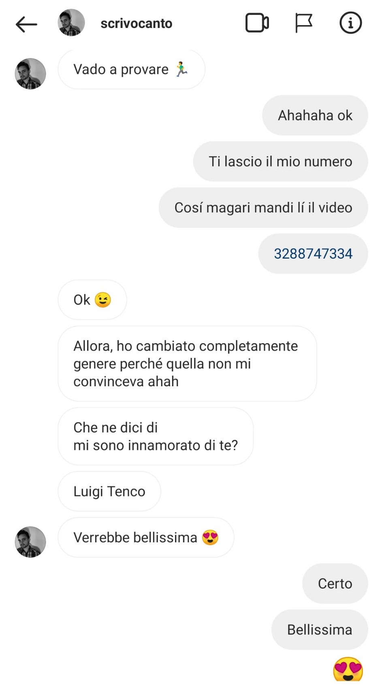
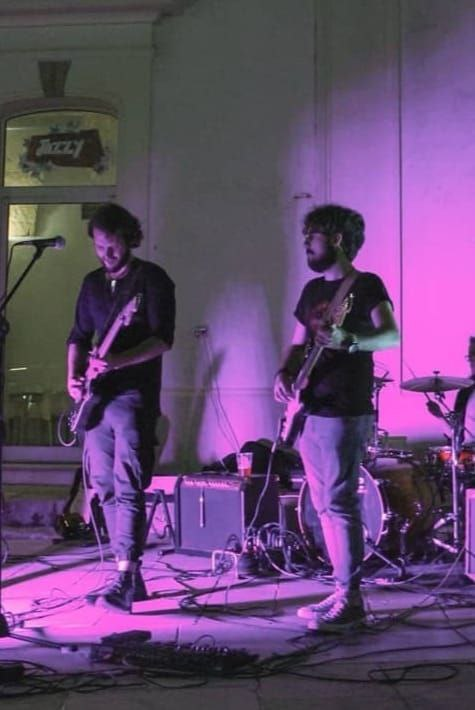
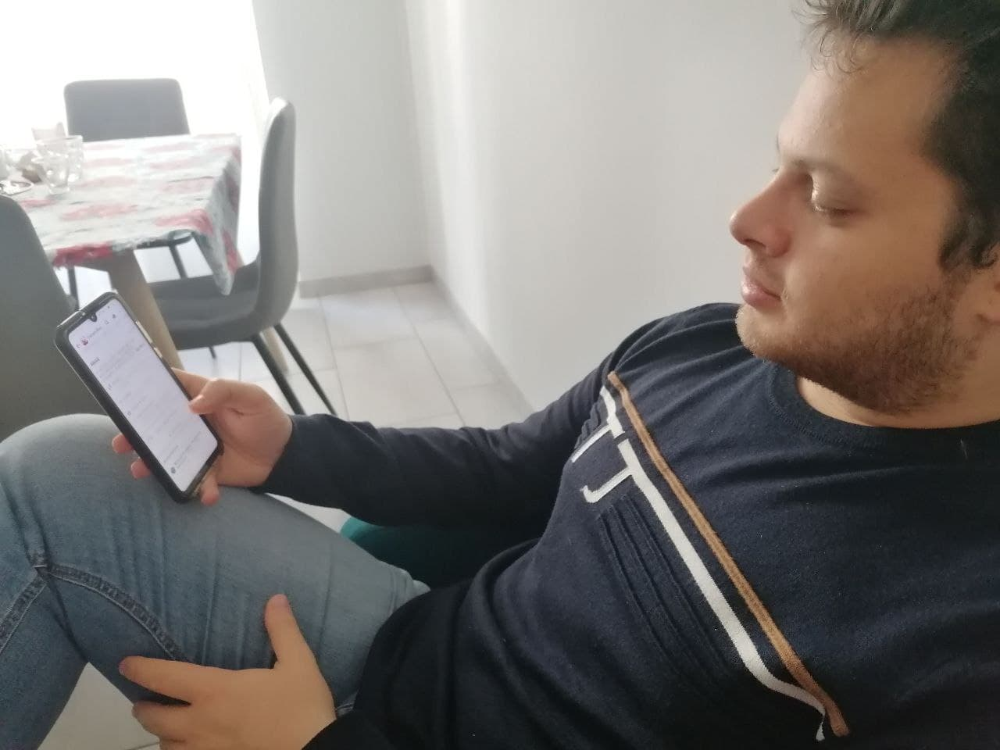

# Milestone 1: Project description and Needfinding: Quartet

## Overview and planning
Since the project aims to explore the process in which musicians deal with a team building, the main activity is to support singers, writers and instrument players in creating teams for short (e.g. *one shot exhibition*) and long term (e.g. *stable band*) musical collaborations.

*Target* – samples we are planning to observe are young amateur singers and musicians (ideally between 15-30 years) who:
- (<b>experienced</b>) had more past experiences inside a band and currently collaborate with other artists or are looking for collaborations
- (<b>unexperienced</b>) had few or no experiences inside a band and are looking for collaborations

---

According to this plan we decided to observe and interview these samples:
  

    

        
        <h6 style="margin-bottom: 1px; margin-top: 3px; font-family: Avenir Next">Federica, 23</h6>
        
amateur guitarist and voice (<b>unexperienced</b>)

    

    

        
        <h6 style="margin-bottom: 1px; margin-top: 3px; font-family: Avenir Next">Federico, 21</h6>
        
amateur guitarist and piano (<b>experienced</b>)

    

    

        
        <h6 style="margin-bottom: 1px; margin-top: 3px; font-family: Avenir Next">Luca, 26</h6>
        
amateur drummer and guitarist (<b>experienced</b>)

    

    

        
        <h6 style="margin-bottom: 1px; margin-top: 3px; font-family: Avenir Next">Alessio, 24</h6>
        
amateur guitarist, pianist, and bassist (<b>experienced</b>)

    

     

*Activity to observe* – The observations we are planning to do will be made looking on each subject in his process of interacting with other musicians in order to seek a collaboration: we are focusing on how they *find* someone and *evaluate* them in order to decide whether to contact them or not.

It will be not always possible to directly observe the physical interaction between the musicians once they met, hence we are planning to recreate some interactions.

## Observation

The following observations are not all live: in particular we asked Luca and Federico to recreate the scenario that they did in the past for performing the activity.

#### Observation on Federica

Federica does not like to play permanently in a band, at most she goes in search of occasional collaborations. For this reason she has created an Instagram page specifically to post some clips of her performances.
During the observation she was contacted by another singer in DM.

    

        
        
        
    

 As you can see from the screenshots there are three curcial steps:
- @scrivocanto contacts Federica for making a one-shot collaboration playing a cover;
- understanding phase on the track to be performed (other screens here omitted);
- release of the Whatsapp contact to continue the discussion elsewhere since the platform used was not so suitable for sharing videos.

During the Whatsapp discussion they agreed on their part, starting the collaboration. Then they submitted related test clips in order to compose the final performance, which was published on his Instagram page and on his official website.

#### Observation on Federico 
Federico likes to use the various social networks at his disposal to contact musicians with whom to collaborate, permanently or not. As a result, he prefers to contact interested people directly via chat on Telegram or Whatsapp. For this reason, before making an appointment with a singer/musician he prefers to have a test of his skills through short videos or reels of a few seconds. During the observation, Federico therefore looked for people with whom to collaborate within his study group that he has on Whatsapp.

    

        
         
        
    

     

As we can see from the images above Federico tried to contact other members to form a band through the Whatsapp group of his university friends, expressing the request to want to form a band and indicating the two types of fundamental instruments that according to him would be the best with which to complete. After making an agreement with these people, Federico tries to find a place where he can play that is good for everyone and during the research phase he realizes that it is not as simple as it seems: they couldn't agree on the place where going to play together.

#### Observation on Alessio 

Alessio usually meets new people with which he can start a collaboration through "Jam Sessions", where someone (usually an already existing band) brings their instruments and let them be freely used by whoever wants to play something. 
Jam sessions can happen in both open or closed locations, and anyone can freely play around or on a stage. The stage allows you to exhibit with someone or to let you be seen by a larger quantity of people, but even playing around can be an opportunity to be noticed.

In an open space jam session Alessio starts playing both alone and with a friend, and a lot of people gathers around them to see the exhibition. In this phase, someone look curious and talks with some friends around them, commenting the play and their skills, someone else gets dragged in the mood.
After the exhibition, Alessio walks around trying to find someone that he likes, and starts watching other people performances. He seems more interested in bassists and drummers. After wandering around for a litter, Alessio lingers in front of a drummer, evaluating his skills, and then asks him some questions about from how much time does he play and his interests. Then, he introduces and asks him if he's interested in playing together sometimes.

    

        
    

     

Here we can see Alessio playing in front of everyone at the jam session, trying to impress someone.

#### Observation on Luca 

Luca is a guy that plays in a band and he is trying to find a bass player.

    

        
    

     

Luca wrote a post on a Facebook group called *"Cercasi Musicisti per band: chitarristi, batteristi, cantanti, bassisti, dj"*. He was doing that because he needed a bass player which could join his band. After a couple of hours, Luca received some *likes* and direct messages from people who where interested on his request. They chatted privately and he asked them about their experience and professionalism (musical genre, past collaborations), their location (which he preferred to be near his town), availability (for example how many times would he be available for rehearsals). After a first selection, he met the remaining candidates separately and in person and, in consultation with the other members of his band, he made his final decision on the new band member.

### Interviews

    1.  How was your passion for music born?

**Federica**: Good question: it was born through my father. He bought me a guitar and encouraged me to play. From that point on thinghs got better and better.

**Federico**: My passion was born simply by listening to music at home. Consequently, I chose an instrument, quite sentimentally, and from there I signed up for a course and started taking lessons from a teacher.

**Alessio**: My passion for music was born about when I attended middle school, I mean I always liked it but in general I didn't ever play a real instrument. Then I met a schoolmate, I went to his house, I saw the instrument and then I started to play it. Then let's say that everything went downhill.

**Luca**: I am assuming that a musician must live in an environment surrounded by music in order to start and move on. I was born in a family where music was always around me, thanks to my father; moreover, my sister has also started playing and is pursuing this passion of hers.

    1.1.  What kind of instrument do you play? Are you able to play multiple instruments?

**Federica**: I started the guitar and for many years I only practiced like this. [...] Then I started to play the piano and I also tried the bass and the drums.

**Federico**: I play the guitar because it is the instrument that I have studied the most but I also play the piano even if I am not very good at it.

**Alessio**: My main instrument is the guitar, however I also play the piano in a little rudimental way, and the bass (I think that every guitarist has a natural attitude for the bass), and the battery, only the basis.

**Luca**: My main instrument is the drums, but I started studying music in the sixth grade, only doing solfeggio and never trying the instrument. Currently I also play with the guitar and with the bass.

    1.1.1.	Is there any particular reason why you prefer an instrument w.r.t another one?

**Federica** I prefer the guitar because I can play and enjoy almost any song and, compared to the piano, I feel more comfortable.

**Federico**: I definitely prefer the guitar, which is my main instrument chosen from the beginning, because it gives me more satisfaction in playing it, it is complex and allows those who play it and those who listen to it to experience different sensations depending on how it is played. While, i think that the piano is a little more limited from this point of view.

**Alessio**: In my opinion the guitar is an easily transportable instrument, you put it in the cover and take it where you want, while you cannot do this whit a piano, and it's still complicated with a keyboard. Then it depends also on the genre: the guitar it's not much useful in a classical scope, while in pop and soft music it's everywhere, and the piano too, while you can find this hard for wind instruments.

**Luca**: My main instrument is the drums, but I started studying music in the sixth grade, only doing *solfeggio* and never trying the instrument. Currently I also strum with the guitar and with the bass. 

    2.	Let's talk about your experience: do you remember your first experiences together with other musicians?

**Federica**: My first experience was a group of friends from school. We began to "strum" with a certain frequency inside the garage of my house, which was set up as a music hall. We did some rehearsals and we had fun, but it ended very soon.

**Federico**: The first was following the creation of a group with some of my high school friends. We met in a rehearsal room to try to play various pieces and then we managed to find a place where we could perform. It was quite fun even if there was not a great understanding, which was the most complicated thing to find at the beginning in the rehearsal room, especially in terms of musical opinions. In fact, it is important, in my opinion, that all members have a fairly congruent repertoire. In any case, we still managed to play in various street demonstrations with entertainment songs that maybe sometimes we liked more than the public.

**Alessio**: My first time in which I played was an event called "emerging bands", and i needed to find a band since i hadn't one, and it was difficult in the beginning since the bassist was unfindable: there was a shortage of bassists, while there were a lot of guitarists.
Between the lads of my age there is this prejudice based on the fact that the bass it's a background instrument, which isn't true. Someone i don't remember says that "when the bass is there you don't hear it, when there isn't you hear it", since low frequencies give that fullness sensation that you notice when there aren't any.

**Luca**: Yes, I also remember that the real springboard for my passion was to start playing with other people, not just with the solfeggio teacher.

    2.1.    Did you already know the other members of the group?

**Federica**: -

**Federico**: Someone yes and others no, for example I already knew the singer, as well as the keyboard player, while the other guitarist, drummer and bassist did not.

**Alessio**: The group of people with which I play every now and then, in the evenings, no: we met in the jam sessions. I meat my bassist and my drummer there, and it's important that you can see what you do in the way the others do, it's also a growing cue, I mean you see another guitarist/drummer/bassist and tell yourself "mamma mia, he's so good", which is something that encourages you.

**Luca**: Initially I joined a musical association and started playing in an orchestra to then have my first experiences in different bands as well. My first band was born by contacting a classmate of mine who played the guitar, and then contacting other guys from the association, first as a bassist and then a singer, to create our first band.

    2.2.	How did you organize yourself to manage the dynamics of collaboration? Maybe you could talk about how you handled rehearsals, any internal problems, conflicts or different points of view.

**Federica**: The first step is to choose what you want to play, driving the group towards a direction. One person wants to do one kind of music, another person wants to do another: in case you have to find a compromise between each other. Then, you have to try your track; personally, I have always studied the song individually, then we agreed on a weekly meeting for playing together.

**Federico**: Everything happened in reality, we risked several times to melt due to internal disagreements but luckily everything went well in the end. The rehearsals in any case managed to be pleasant, even if there were times where maybe someone was unprepared about some song and consequently it was not possible to be all perfectly aligned.

**Alessio**: Yes, as soon as I started playing it was necessary to rehearse. Take into account that we played few times every year, after according on some songs, listening them and starting to understand ho to learn them. We met twoo-three hours each time. We argued many times since the guitar was always too loud and the drummer made too much mess. In the beginning it's hard, then you learn how to play together. The problem is make everyone agree, for example someone wants to play a song exactly as it is, the others dindn't want to, so the first conflicts were born.
Personally I had some problems with drummers, to say (it's not always true but happened to me the most of the times) when you are talking, drummers cannot avoid to beat on the drums. Other commonplaces: guitarists must have the amplifier to the maximum, bassists are always hidden.

**Luca**: We were very focused and enthusiastic about our collaboration, rehearsing for 3 hours a day most days. The biggest internal problem was to isolate our bassist when we saw that he was collaborating with other bands, which I currently consider very important and indispensable for the career of a musician, that is to diversify between different bands and genres.

    2.3.    Have you ever had problems in finding someone with which to play because of your instrument?

**Federica**: Nope.

**Federico**: Nope.

**Alessio**: I personally have never found problems, but for the bass yes there was alway a shortage

**Luca**: Nope.

    3.	Do you think that members character can influence on the positive trend of the collaboration?

**Federica**: You’ve reached the crucial point: in my opinion, if one person is not open to dialogue in understanding the needs of the other, it’s impossible to play together. [...]. In this regard, I played in a duo where the level between us was different and he was very proud, so in the long run the collaboration was interrupted by personal frictions. Moreover, during another group experience, I was required to be more professional: I joined a group in which they were already experienced, they sang for years in public while I was out of my comfort zone. They didn’t support me in settling in, indeed they were very presumptuous! I haven’t been well. They should have been looking for someone "more seasoned" in singing rather than a novice singer.

**Federico**: I think that if in a group there is not a leader figure, which can be a singer or a front-man, who can direct you in the path you want to take and that makes the audience understand what kind of band you are, you risk losing a lot. In fact, during the lives, the public does not see the single technical error but sees the performance in its entirety so it is important in my opinion to have a person who can best coordinate all the other members.

**Alessio**: I remember fights related to what I was telling you about playing the songs exactly the same, for example the singer sometimes got angry. I'll tell you, if you want to make a band, make it at most two.
Another problem is that anyone were arriving at their times, it's a thing related to your character. More people are more difficult to manage.

**Luca**: Initially I thought that, being the oldest, I could take the reins of the band in hand, but currently I believe that decisions must be made by mutual agreement, because everyone has the same decision-making weight, regardless of age.

    4.  And what do you think, instead, of the skill level? Has it ever influenced the dynamics of your collaboration?

**Federica**: *(she answered before telling two stories)*

**Federico**: I think that the possible disparity that one might have within a group is actually something to be benefited from, so that everyone can learn from someone better, and consequently improve both individual skills and cohesion. If there was the desire to learn and improve of course.

**Alessio**: Talking about amateur level, you always have problems when playing with someone that can't stay in time for example. Of course the skill has an impact, at the beginning there are few variables, it is enough to be able to stay in time. Then it depends on what do you want, you can't call someone that you saw playing only metal to do jazz, or someone that has a different nature than you, expecially for that genre it's difficult to find someone good unless he does only that.

**Luca**: -

    5. [SINGER] Have you ever auditioned to join a band? Why?

**Federica**: No, I never auditioned because, apart from the first experiences in which I was a founding member, the collaborations I had have always matured through social media, in which other musicians had already noticed me through Facebook posts or Instagram, so, at least theoretically, they already had an idea about my skills.

**Federico**: -

**Alessio**: -

**Luca**: -

    6. Let's go back to the present: are you currently collaborating with someone or are you looking for collaborations?

**Federica**: I’m a lone wolf today. I like to collaborate, but only *occasionally*: if I find a musician and I feel alchemy in terms of character, maybe I agree for a collaboration. Basically I play for a purely emotional issue, I don’t want to turn music into a stable commitment.

**Federico**: I don't collaborate with anyone, but if I had some free time the first thing I would do is to find someone to produce music with.

**Alessio**: At the moment we are doing only a project in two, I got tired of people and of making too much noise: only guitar and voice, it's a lot easier, and that thing that I was telling you about the portability of the instrument, you go and bring it to the other one's house, you don't have to connect anything since they are acoustic guitars, let's say that I want something more soft.

**Luca**: Currently I no longer carry on any collaboration or look for new collaborations, but for what I have created in the past I have remained in contact with the people who were part of my old bands with whom we rarely find ourselves to have fun a little, musically speaking.

    6.1.	What means would you use to propose yourself or looking for a collaboration?

**Federica**: I find social media, as I said before, very useful because they allow me to observe a musician, what he plays, what are his musical tastes, his level, and then contact him and eventually estabilish a collaboration in order to produce a musical clip.

**Federico**: Surely through university Telegram or Whatsapp groups because I would be able to find people who are in my same target and perhaps with my same interests.

**Alessio**: -

**Luca**: -

    7.	Compared to what you told me about your past, have you developed any convictions on how to show off?

**Federica**: I believe that negative experiences help you to understand how to move in this sea: For instance, I'm not able to play with people who are too different with respect to me: character first, then the musical genre. But, honestly, since I can’t find many artists who think like me, I prefer to work with myself. I’m better off alone, without a stable group.

**Federico**: -

**Alessio**: -

**Luca**: Of course, thanks to my experience I understood that you have to start playing, in any way, with other people, and then start making evenings and playing in public. This was my system to get to know and make myself known to people.

    7.1.	Do you think social networks can be useful tools for this purpose?

**Federica**: Yeah, they’re huge showcases to show off.
At some point in my life I felt the strong need to highlight myself and I realized that an easy way to do that was to post Instagram clips. They appears useful in this perspective during the covid period: I know guys who started publishing to have fun, and then they organize themself in stable collaborations. [...] They were also useful to look for, not just to propose: once I published a story on Instagram "AAA wanted bassist" and I received some interesting answers.
Another means are the Facebook pages, but honestly I rarely use them because I think that they are too dispersive and do not allow me to "observe" well who I have in front of me, so I prefer to browse Instagram and personally select which profile could be the most suitable. I notice, however, that they are very used in cases of "emergencies", where it is necessary to quickly replace a component before a live.

**Federico**: -

**Alessio**: -

**Luca**: Yes, in recent times I have noticed that when a band is looking for a musician they put ads on various social networks.

    8.	What are your personal needs when you looks for collaborations with another artist?

**Federica**: In my opinion, there must exist feeling at character level: I tend to collaborate with musicians with a personality and menatlity similar to mine. Of course, musical genre is not so secondary, but you can come to terms with it. In addition, it is necessary to make clear the goal to be achieved: how I said before, I don't look for stable bands or collaborations, since I don't want to force my passion turning it into a professional work, instead of many other musicians who wants to pursue a musical career or wants a stable group.

**Federico**: First of all I need availability and passion. Consequently, my personal need is to have to deal with people who do everything to be able to play/rehearse together and also to learn something new.

**Alessio**: You tend, at parity of skills, to call someone nearer to you than someone further, also for him, it's a necessity the easiness with which you can meet. Another need is the genre that you want to do. Also, the versatility of the musician, sometimes you need to be able to adapt, for example some times ago a friend called me to substitute him in a Bob Marley cover band (and I truly hate raggae), even if it disgusted me I went, since they payed me. In the end, raggae it's easy to play. If it were a progressive metal band (things that I haven't done for a lot of time) probably I wouldn't have gone.

**Luca**: The first need that I would currently want in an artist is to be agree with him from a personal point of view, because, from the experience I had, it is easier to talk about a musician than a band, precisely because within the band the musicians can change, it's part of the game.

    8.1.   Do you find it difficult to find someone to collaborate with? Which ones are these?

**Federica**: -

**Federico**: I think that a lot depends on the geographical position to which we refer, because maybe in big cities it is easier to organize and get in touch with passionate people than in others. In any case, as far as my personal experience is concerned, I have never had difficulties using the social networks and the means that I have listed above.

**Alessio**: -

**Luca**: -

    9.  To conclude: do you have something else in mind that I did not ask you and that, in your opinion, may be interesting to discuss?

**Federica**: -

**Federico**: Basically what would be important for me is to find a platform that helps and facilitates me in shortening the time of recruiting and organizing rehearsals with other artists. Very often, in fact, I have understood that I have a great desire to play with someone but that I am unable to organize myself in terms of schedule, overlapping commitments, different genres, etc.

**Alessio**: Look: it happened to me few times that maybe under a given cachet (i.e. money, remuneration) a musician doesn't come. Moreover, generally I played only covers, not things made by me. About socials, instead, usually they are used only for emergencies, I mean if you need someone at the last moment you write an announcement.

**Luca**: -

## User Needs
According to the observations and the interviews we have identified the following user-needs:
1. **Needs a way for matching musicians according to the instruments played, their musical genres, the type of collaboration (one-shot or band), geographical position, time-schedule and personality-match.**
2. Needs to find and establish a common place where they all can comfortably meet together for playing. 
3. Since the musicians struggle to plan when to play together, which influences the collaboration during the beginning, can be valuable a way for scheduling each member commitments in common slots for establishing musical sessions.
4. **Needs a way to check the candidate's skills before letting him/her join.**
5. Highlighting and supporting the most frequent requests on an instrument during a specific range of time.

## Project Description

- The project will aim to allow users in supporting the **needs 1 and 4**.
Hence the goal is help users in looking for and choosing the most suitable members according to their musical and organizational preferences between different musicians providing a way to evaluate their specific skills.

- The process analyzed does not require specifical constraints that force the usage of a device rather than another one, but we think that the main target devices should be **smartphones**, because they appear as the most used means of our potential users.
