# Milestone 2: Prototyping and Heuristics - Quartet

## Storyboards

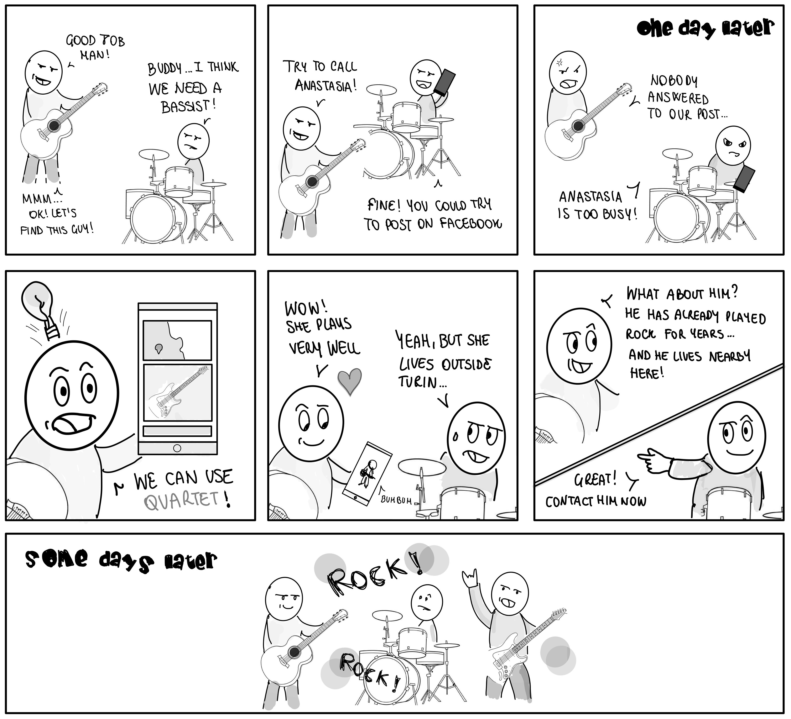

🎸 *two amateur rock musicians need a new member for their band. Neither a post on social media nor a call to a friend is enough, hence comes the idea to use Quartet application. The most suitable profile for the new bassit is identified by looking for a location around Turin, their musical genre (a rock band) and watching some video performances Therefore, he's contacted and the story ends with the two users with the new bassist playing all together.*

---

This storyboard has been chosen because it could be a power context in which Quartet can be used: according to the interviews and requirements collected in the previous milestone, a service that integrate various ways of selecting musicians can benefit in choosing the most suitable profile and, consequently, the positive trend of the collaboration.

#### strengths of the storyboard 
- emphasis on the capability to integrate the chosen instrument (bass guitar), the musical genre (Rock) and the position around the protagonists (Turin).

- enable to evaluate the skills of the potential candidate through videos about their performances.

#### weaknesses of the storyboard 
- it does not fully express the power on selection: the candidate investigation can be based on other information such as a personal description, a skills self-assessment, the collaboration goal or, again, on his preferences in terms of time for any rehearsals.

- imagine what could happen at the end of the story: once played together you could receive a positive or negative feeling about the experience with the selected profile: it does not illustrate the possibility of being able to evaluate a musician during/at the end of a collaboration (especially for one time performances) providing useful some feedbacks for other users.

🎯 In the story the users need is finding the most suitable bassist for letting him/her join in their rock band: the goal is well achieved by searching people who play that instrument and looking for others matching criteria such as a location around Turin and the musical genre. Also, watching some performances is useful for getting a better idea on the skills of the musician.

---

## Paper Prototypes

### Paper prototype #1

The first paper prototype aims to represents the scenario described by our *storyboard*, providing an interface which focuses first of all on the geographical location, so that he can immediately feel the presence of potential musicians around him. This is implemented through a map, which takes into account all the registered musicians who meets the user's requirements; hence the user is able to move along and interact with the map for exploring new locations of interest. On the other hand, it suggests to explore further facilitations via the application of some useful and easily understandable filters, driving the user in a comfrotable search process. The prototype is therefore interpreting a user mental model for which you must first reassure about the position of interest (which can be modified or not) and then guide you to the application of some filters aimed at finding the most suitable match. The system is eventually able to achieve the *objective of the project*, allowing the user to evaluate a musician and check the feedbacks given by other users on in such a way as to minimize the probability of error in meatching the best possible collaboration according to him/her preferences.

    
As first impact, the system shows the musicians around the user according to the city setted during the registration phase (here omitted). This is done via a map, so that he can have an idea of how many potential users are avaiable around him. From here, he could press the button on the top-left, from which could change the searching location typing a new city of interest and an action range (km).

    <h5>(I) Initial screen </h5>
    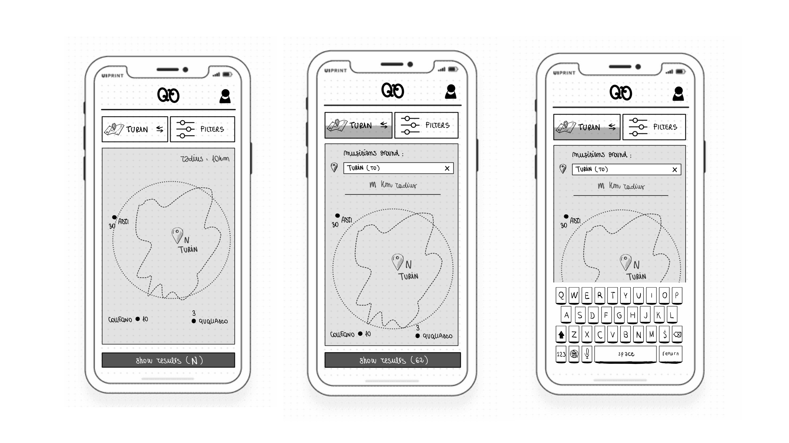
    
All the other filters can be applied: the user is able to search another one by name (a dialogue clarifies the usefulness of the action); the instruments played are considered the fundamental element presented to the user for filtering, so that they can be picked out; than, the musical genres, a prefereed time-range for rehearsals and the type of collaboration (long-time such as new member for a band or one-time collaboaration as single performance). Dialogues can be opened for clarifications.

    <h5> (II) tap on the top-right button</h5>
    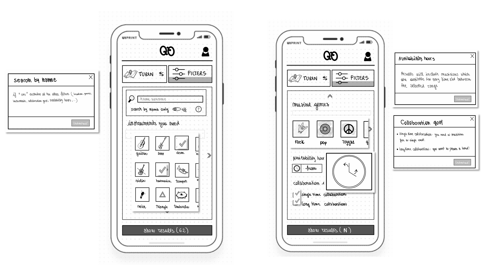
    
A list of the users avaiable according to the filters is shown. Each item provides a brief description about a certain musician. Back button can be used for going back to the previous state. Tap on "open profile" leads to a complete description (here the back button can be used for moving back to the whole list).

    <h5> (III) tap on show results button</h5>
    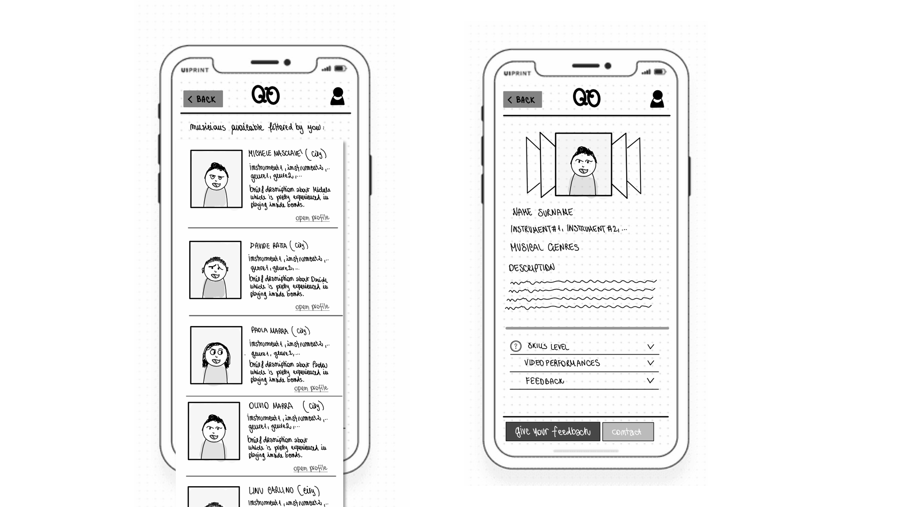
    
Three collapsed menus can be exploded: from the first one the user is able to evaluate a self-evaluation of the candidate (a dialogue for clarifications); from the second one the user can evaluate the musician skills watching some video performances; from the third one he can investigate about previous collaborations reading some feedbacks posted by other users.

    <h5> (IV) tap on collapsed menus</h5>
    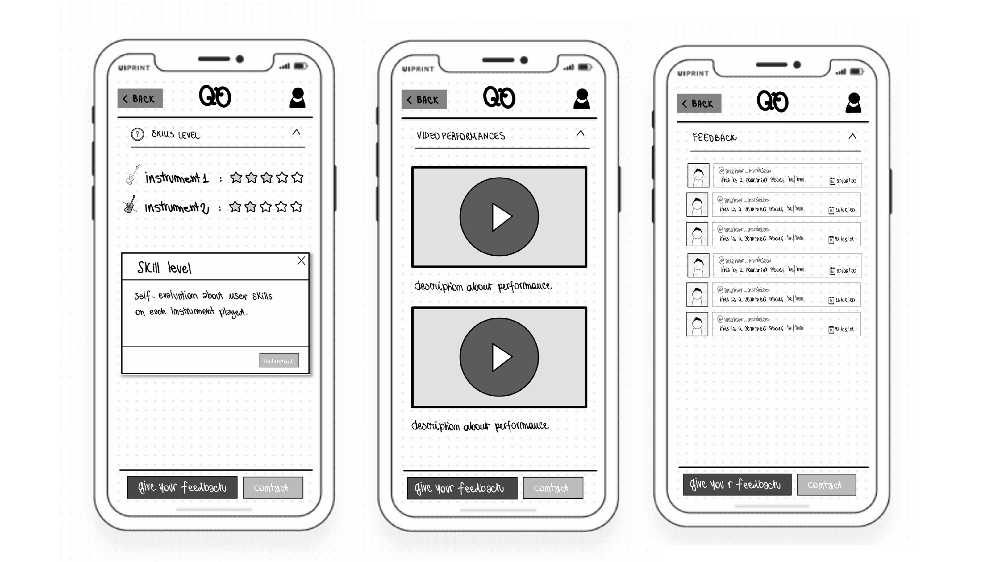
    
The bottom-left button allows the user to write a post about the selected profile; once the comment is submitted, it will be visible going back to the feedback menu and could be erased. The bottom-right button, instead, concludes the searching process, providing to the user all the possible means for contacting the desired musician and starting the collaboration. 

    <h5> (V) tap on footer buttons</h5>
    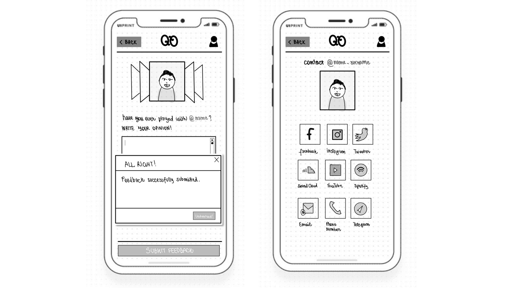
    
The user is able to visualize and change his personal information, from the profile photos to the personal details. In particular a complete description can be used for talking about himself and his past experiences, instruments played, musical genres, self-evaluation, avaibalbility hours and desired collaboration goal. Also, "avaiable" toggle allows to hide/show the profile in the list of the other users. The slider of video performances can be updated and contact details should be filled in.

    <h5> (VI) tap on the top-right profile icon</h5>
    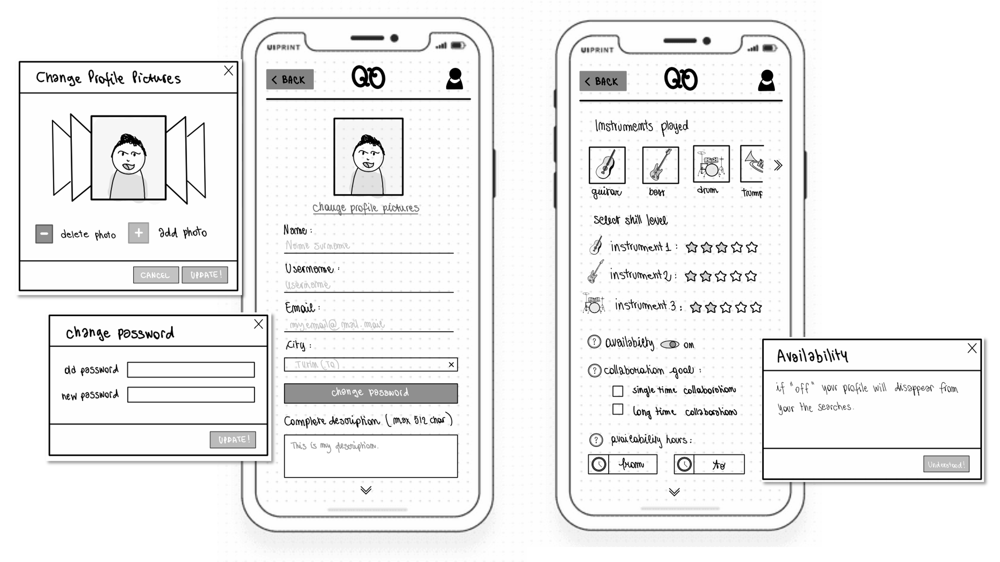
    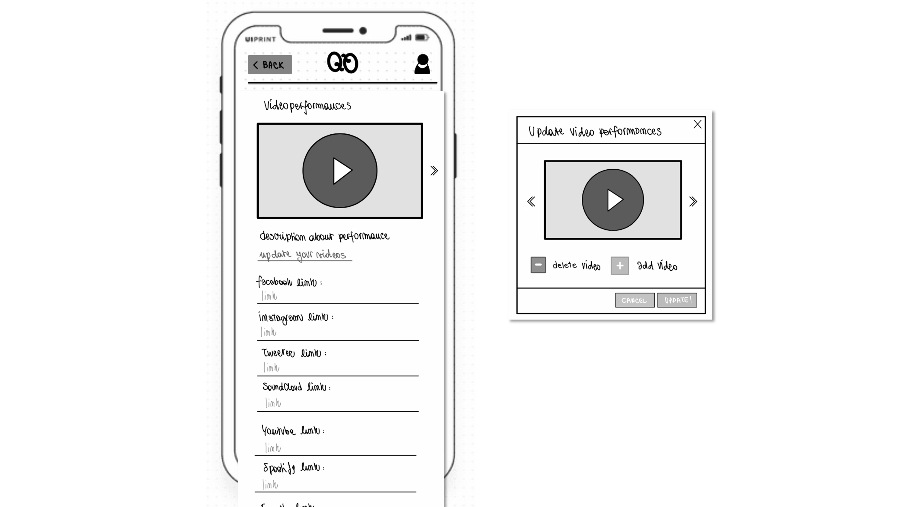

---

### Paper prototye #2

The second paper prototype, on the other hand, has the purpose of providing an interface that is as vertical as possible so that the user can already initially have a complete overview of the potential users who populate the application and who have certain characteristics that agree with the base information entered by himself in his profile or applied before with the filters. It also provides a schematic and easily memorable way in terms of actions to be carried out to filter with respect to certain characteristics. Also in this case, moreover, the system allows you to reach the *goal of the project* by directly verifying the opinions given by other users with respect to the musicians he seeks as well as allowing us to give an opinion in relation to a specific collaboration with one or more musicians.
    

    
As a first impact, the application shows all the musicians who could be contacted in relation to the user's preferences. In particular, the information displayed is relating to the instruments played, the genre of the artist and its geographical position as well as a brief description. The second screen, instead, is the screen following the tap on the button at the top left that allows the user to view the page relating to the search filters that can be set. In addition to this there is also a back button that allows to go back to the list view, a show results button that shows the results associated with the filters set and a button at the top right that allows to check the associated personal settings to user profile

    <h5>(I) Initial screen </h5>
    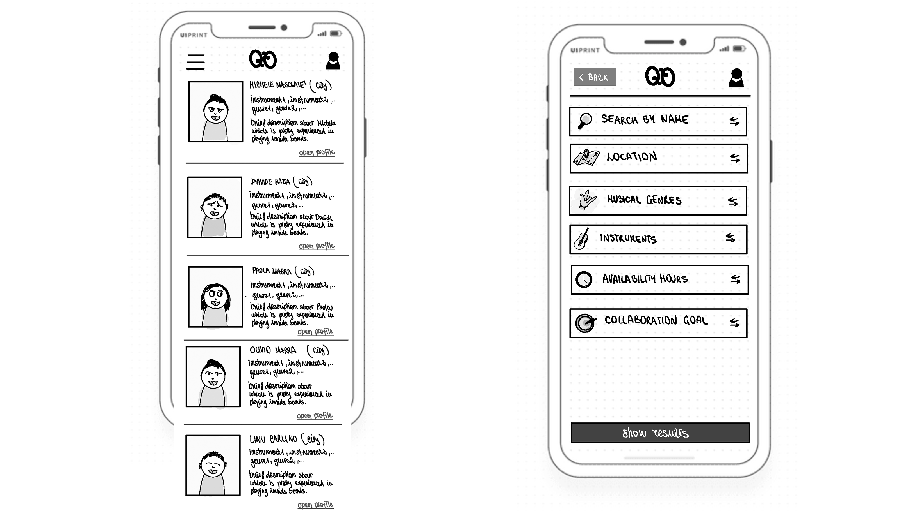
    
After tapping on the buttons associated with the various filters, it is possible to view screens that are functional to their application. In particular, for the filter on the location, it is possible to set the starting city of the search and the kilometric range relating to the radius around a specific city. For the name filter, the user can type the name to search for in a checkbox and explicitly indicate whether you want to keep the other search filters anyway or not. For the filter on musical genres, it is possible to tap on the icon associated with the genre in order to provide it as a search filter.

    <h5>(II) Filter screens 1</h5>
    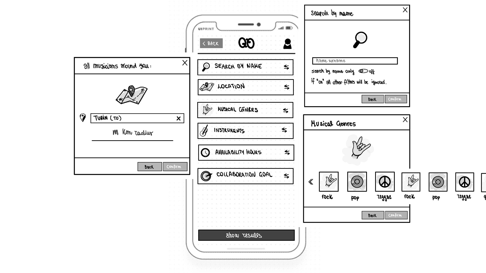
    
For the filter on instruments it is possible to choose them through a similar and consistent method for the filter related to musical genres. For the filter relating to the times of availability, it is possible to make this selection by displaying two clocks that will guide the user to choose correctly, as well as clarify his ideas on the meaning of these times through a diclaimer that can be displayed following the tap on the "?". Finally, as regards the collaboration goal filter, it is possible to set it through a multiple selection screen which also provides a disclaimer reachable via "?" which explains the two selections on the screen.

    <h5>(III) Filter screens 2</h5>
    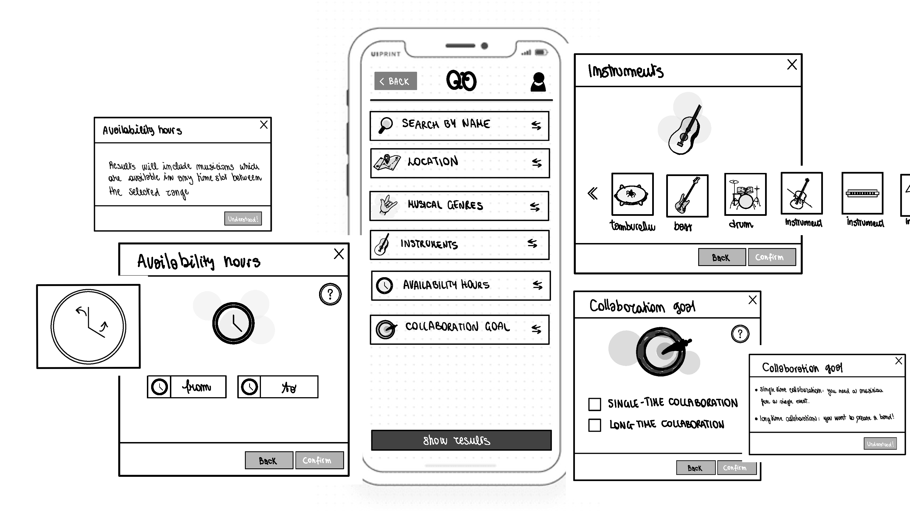
    
After tapping on "open profile" in relation to a musician found in the display screen of all the filtered results, it is possible to view the information relating to that musician through a screen that provides for the display of: various profile photos of the musician, instruments played, musical genres and a description given by the musician himself. In addition to this, it is possible to view through the drop-down menus: skills level of the musician (section that also includes a disclaimer reachable via "?"), Video performances of the musician and feedback that other users have posted in relation to this musician. In addition to this, the screen has two buttons that allow you to contact this musician or give feedback about a past experience with him/her.

    <h5>(IV) Musician profile </h5>
    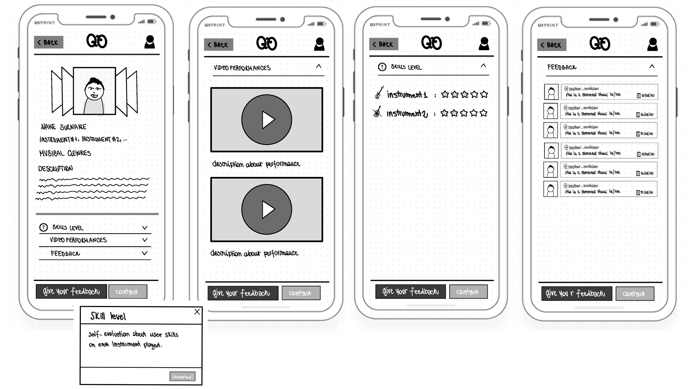
    
From this screen, once you have pressed the "give your feedback" button, you can view another screen through which you can write an opinion on the selected musician. Once written and clicked on the "submit feedbakc" button, a disclaimer will appear indicating that the feedback has been entered correctly. Instead, by clicking on the "contact" button it will be possible to display a screen that will allow you to tap on the icons of the various social networks entered by the musician in order to contact him through them.

    <h5>(V) Contact a musician and give a feedback to him/her </h5>
    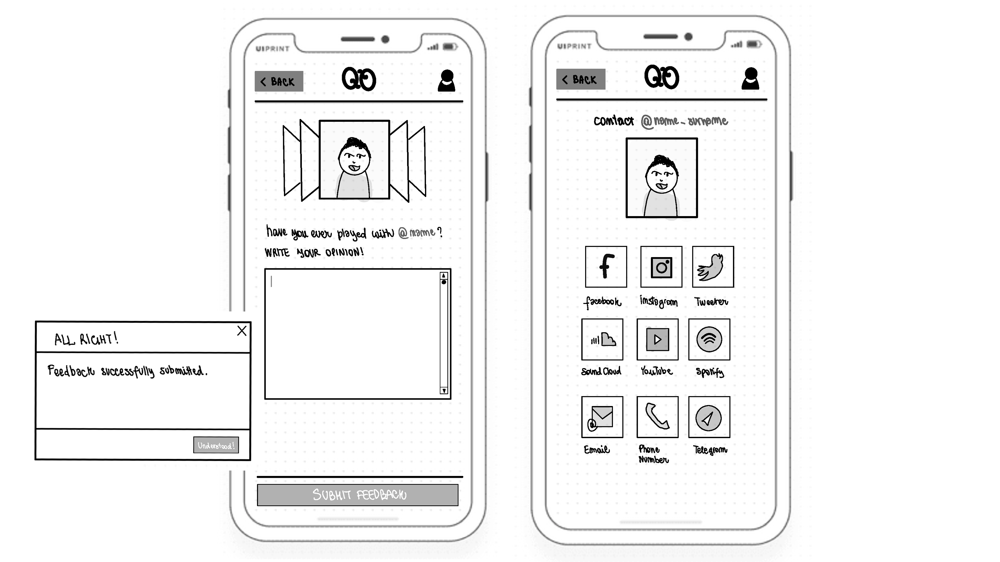
    
From each screen of the application it is also possible to access the user profile of the user logged in at that moment, by clicking on the button at the top right.In this screen it is possible to modify all the information entered during user registration such as : profile photo (via an additional screen that allows you to delete photos already uploaded or upload new photos directly from the device), name, username, email, city of location, password using the appropriate modal, description, instruments played, associated skills levels to these instruments thanks to a classification by stars, availability to be present in the search filters (functionality explained through the disclaimer reachable with "?"), collaboration goal, availability hours, video performances (through an additional screen that allows you to delete videos already uploaded or to upload new videos directly from the device) and links to various social networks.

    <h5>(VI) User profile 1</h5>
    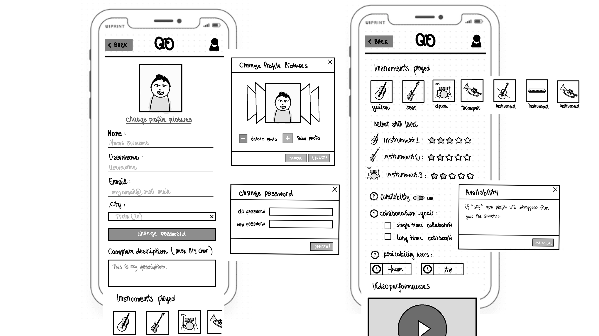
    <h5>(VII) User profile 2</h5>
    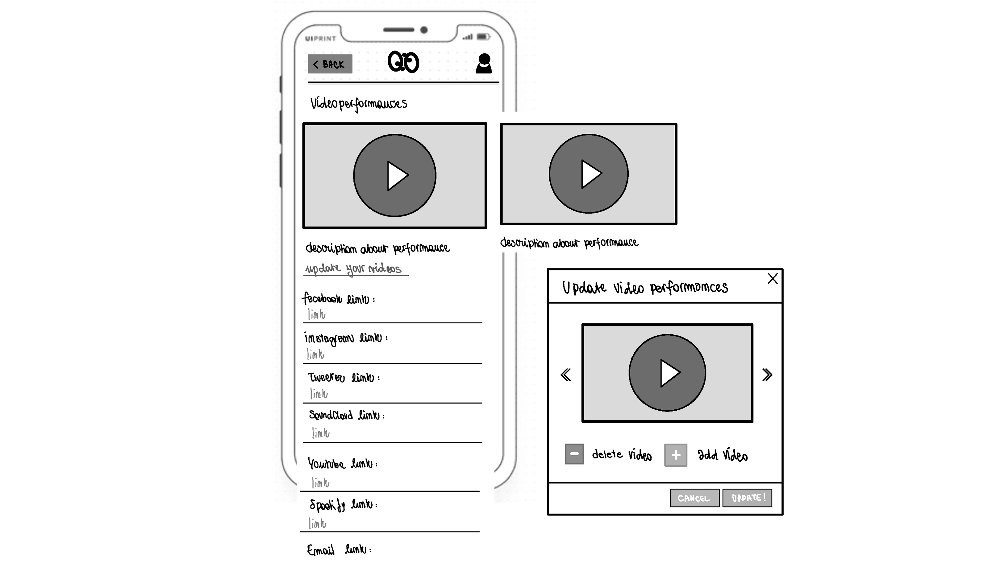

---

## Heuristic Evaluation

The evaluations related to the heuristics received on both prototypes were carried out by two team members related to the *University Orientation* project. In particular, the heuristics they found were carried out following these paper prototypes:

<h5>Material used for paper prototype 1</h5>
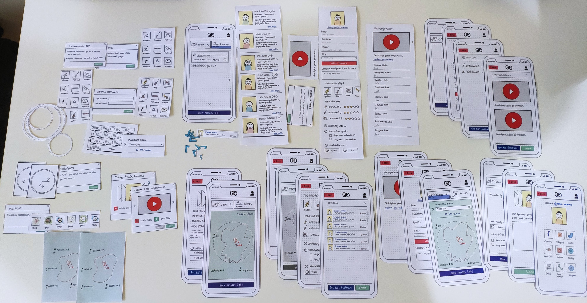
<h5>Material used for paper prototype 2</h5>
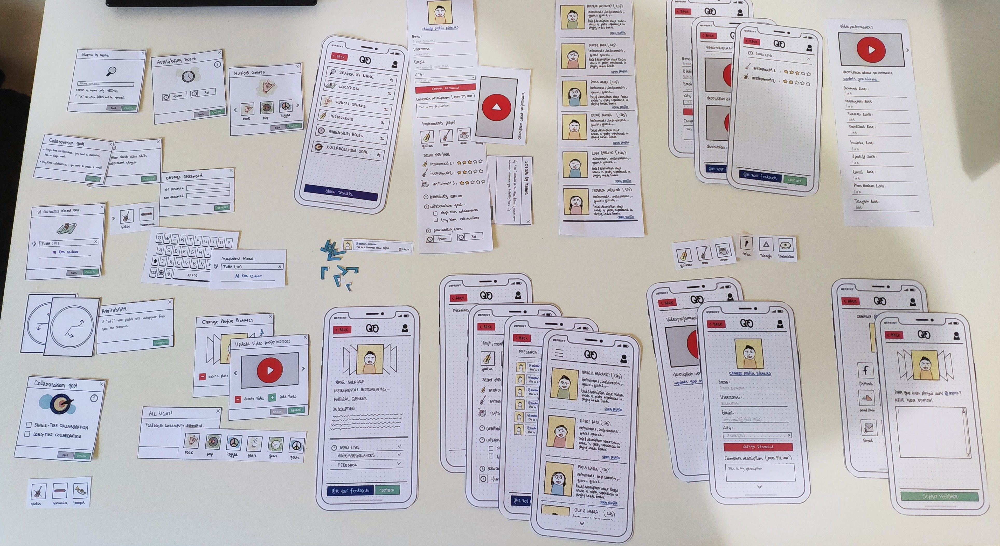

**NB:** *As can be seen from the photos above, the material used for conducting the evaluations is a little colorful. Aware of the fact that the presence of color may have influenced the "navigation" process of the evaluators along the prototypes and colors/font are temporary decisions and we cannot learn a lot about them at this prototyping stage, we carry out the evaluation finding at the end that this aspect did not massively affect their analysis according to the type and the description of the heuristics evaluations issued by our colleagues.*

In the first phase of the evaluation process the facilitator introduced the two prototypes to both evaluators explaining *the goal of the project* and how the various sessions related to the printed screens work to conduct the evaluation. In particular, he explained the process behind the search and management of preferences in relation to the various filters present that can be exploited through the prototype and the management of clickable and non-clickable elements. In addition to this, once the various prototypes were introduced, he filmed the actions carried out by the two evaluators and took note of the salient parts relating to the interaction. Below you can see some photos relating to the evaluation process carried out: 

    <h5>Photos related to the first prototype</h5>
    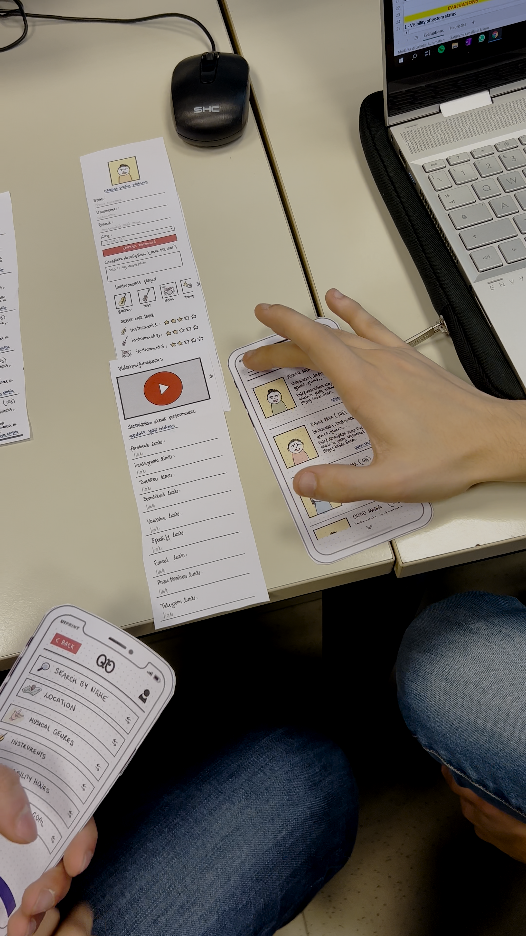
    
    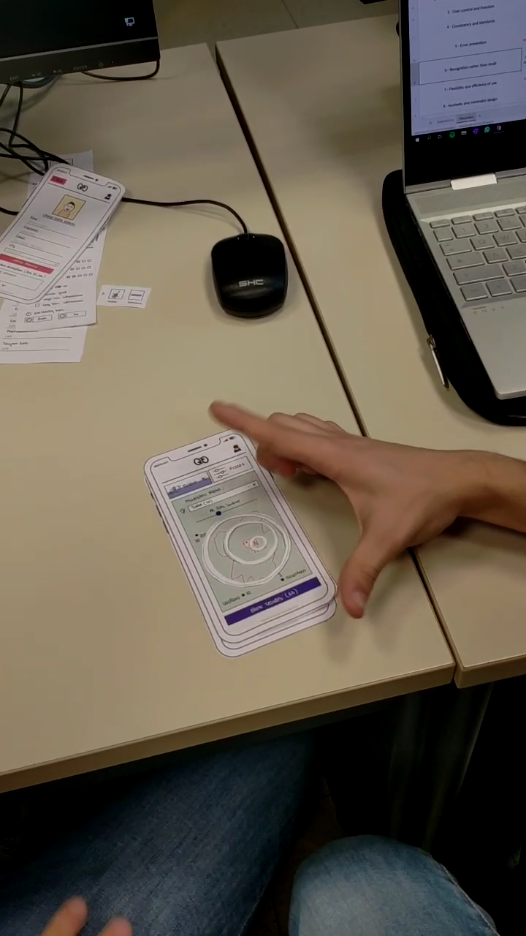
    <h5>Photos related to the second prototype</h5>
    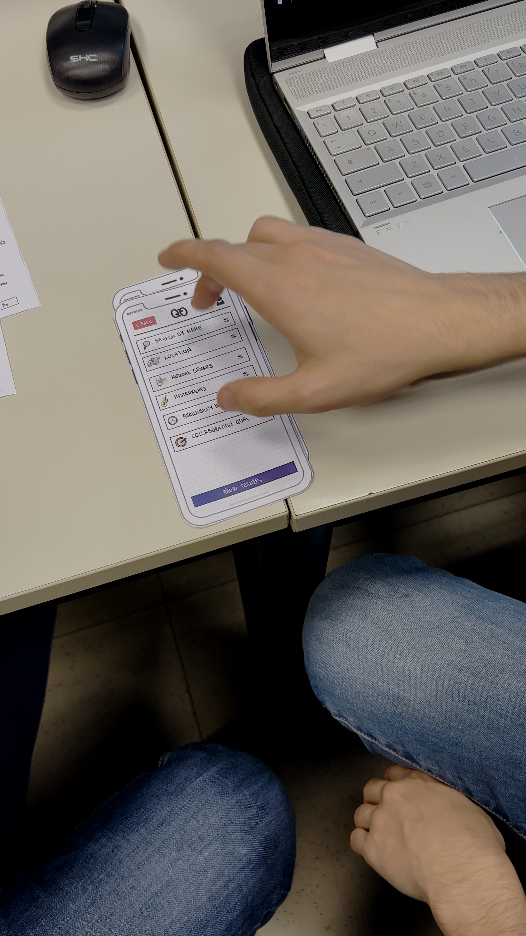
    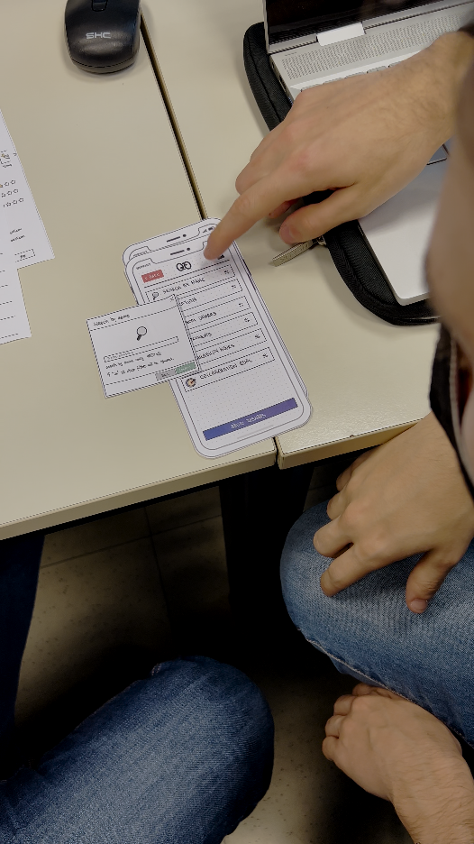
    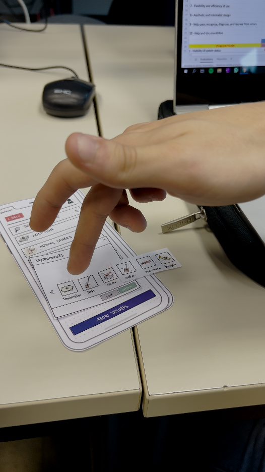

 

The results of the evaluations carried out were collected in the file: https://docs.google.com/spreadsheets/d/1mYVttd8oiTrYaDooHVHZxmHJ9gzrCMShYTqNbrK2H1g/edit#gid=2086519836, in which the comments were reported both for the single evaluations in relation to a single evaluator and the joint evaluations of both evaluators who tested the prototypes.

## Potential changes
According to the evaluations received, we decided to focus on the *first prototype*. Indeed evaluators comments and their heuristic evaluations on the second prototype highlight how the user desires an immediate and visible feedback about his geographical location (setted on registration phase or when he/she changes it) and the position of the other musicians around him/her (see *prototype #1 issue #3* on google sheet above), instead of watching a list of potential users.

Therefore, starting from there, we thought about some possible solutions to fill in the assessments given by our colleagues:

| Issue    | 💡  Possible solution |
| -----------| ----------- |
| #1      | name search seems to be misleading, hence should be: removed the "on/off" toggle (which enables or not the other filters inclusion), then either disable the other filters in the same screen in such a way to consider the name research exclusive or put the name research in another section. |
| #2      | include the *km* distance between the actual musician's city and the selected one. |
| #3      | include the preferred musician time schedule inside his/her profile screen. |
| #4      | include the spotify/soudcloud/... performances (or link to them) in the profile screen as well as has done for the video performances. |
| #5      | Move spotify, youtube and soundcloud links and icons from the contact screen to the performance screen inside the musician's profile. In fact, it is more consistent having these means as a form of evaluation wrt a contact. |
| #6      | see issue #1. |

