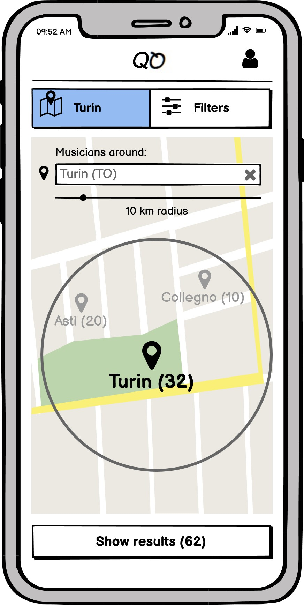
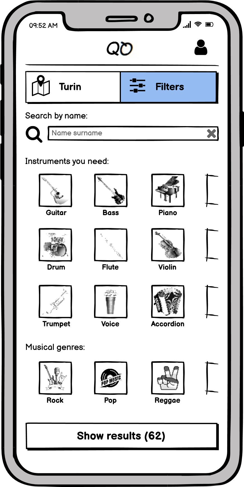

# Milestone 3: Wireframe - Quartet

## Wireframe

As said in the M2 conclusions, the observations made during the evaluation process led us to opt for the first prototype. Here, some considerations accrued following the evaluations provided to us:

- Since some issues had arisen regarding the possibility of searching by name feature, we've chosen to provide a clearer "search by name" filter by *eliminating the "on/off" toggle* from the filter screen, which allowed to make the research exclusive (by name only) or not.

- Since the clock representation of availability hours is hard to decode, we decided to consider a simpler approach in which the user is able to check between three default timeslots such like "morning", "afternoon" and "evening".

- In order to avoid a user to give a feedback to an unknown musician until he/she works with him/her we decided to introduce a section inside all the musician's profiles where anyone can mention the musicians with there was a collaboration and only when both musicians have confirmed the collaboration, then they are able to make a feedback.

- However, we've not removed the possibility of making our search exclusive, as we preferred to highlight this feature after the application of the filters, before listing the musicians found, together with a summary of the filters applied in the previous step. In this way we think the user can receive a double benefit: on one hand he's able to search by name only in order to reach a particular user without applying the filters that led to such a profile, on the other hand he's able to watch the applied filters without neither remember them by heart nor going back to the previous page if he wants just to remove some of the filters applied in the previous step.

- We've taken into account the lack of an immediate display of the *km distance* of a musician from the selected city.

- We've taken into account the lack of an immediate display of the *preferred time for rehearsals*.

---

We used *balsamiq* tool to create the two wireframes based on the paper prototypes made on M2.

     
    
      

We have chosen to represent via wireframe:

- The homepage of our application, which shows the users nearby the selected city together with the capability of change the city and the radius around it.

- The page dedicated to the musical filters (part of it, as the user is able to scroll down), which as we believe it is crucial for the web-app usage: once the user decides the location of interest, he is ready to pick which instruments he is looking for, the musical genres reference and so on. We understand the centrality of this page because, if it were not implemented, the users would not be able to express their preferences, dropping the ultimate goal of the project: building collaborations between musicians based on their characteristic.

     
    
    
Homepage

     
    
    
Filters page

