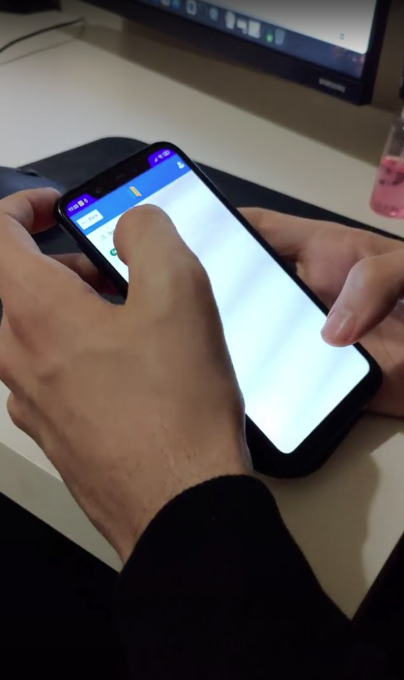
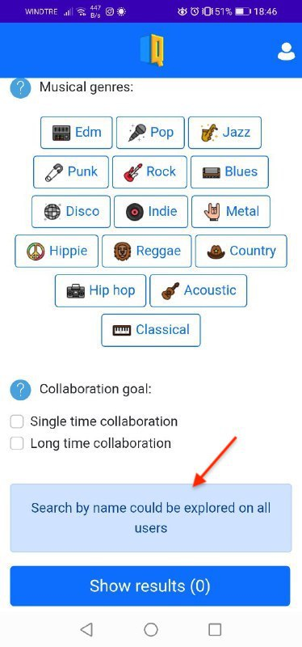
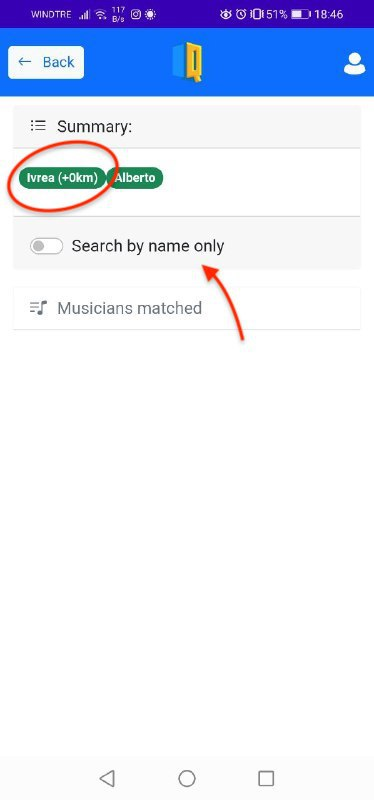
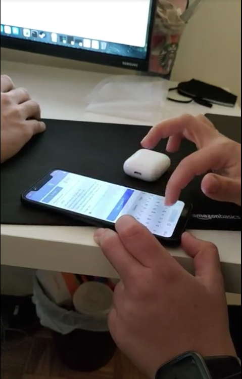
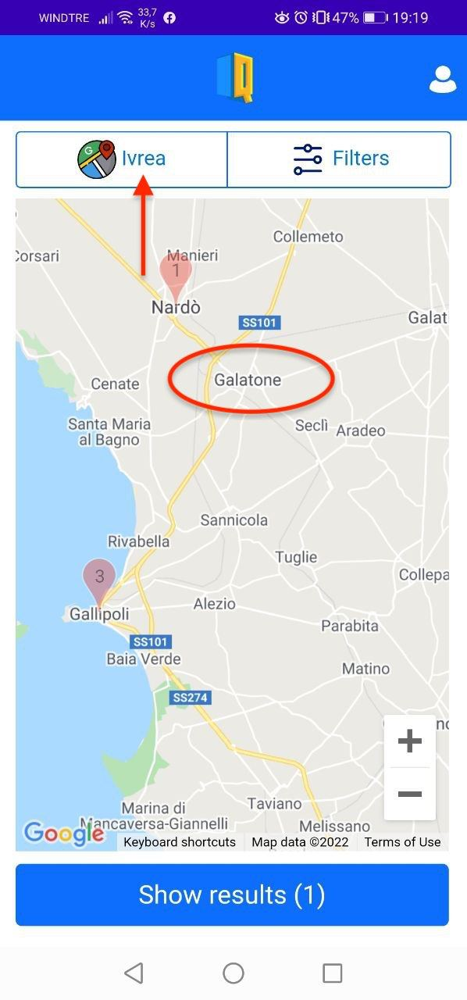
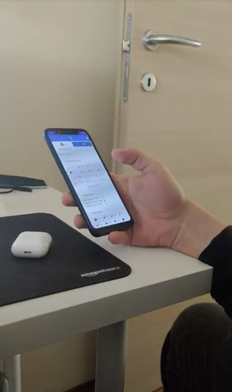
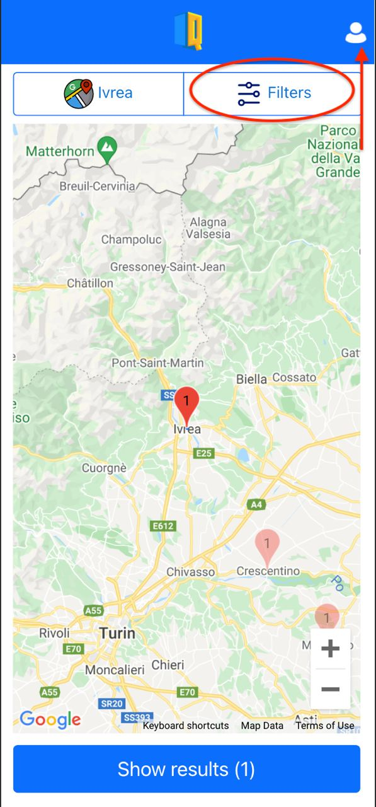

# Milestone 4: Usability Testing - Quartet

## Overview and Script
We've conducted an evaluation based on this usability testing protocol: https://docs.google.com/document/d/1gEbtp7SRKMEb_ni90Xo9U_om6dO1YMDzjWE5zRUVzZI/edit#. This evaluation was performed in relationship to the second-last versions of the Quartet app stored in the repo: https://github.com/polito-hci-2021/Quartet-code. While the facilitator (Stefano) carried out the script, the observers (Michele, Alberto and Lorenzo) have written down all the comments done during the evalutions and have shot the videos. 

After all the evaluations, we've discussed with the participants and we've rewatched the videos to identify better the issues related to the resolution of the various tasks.

We haven't found any particular problem in running the test and we've joined all the results as below

## Results and List of Changes
After the first evaluation, the most crucial issue which arised was during the resolution of the task *T7*. In this particular task, the participant was not able to elaborate a way to **avoid the preliminar map filter** because he thought that he could remove this type of filter like the others. In addition, he thought that he could remove the filters applied directly from the **filters summary bar**. In the same interface he didn't notice the alert related to the possibility to avoid the other filters in the next stage, and neither the **search by name only** toggle. 

Below there are the photos related to the resolution of the incriminated task:

 
    
    
    

  

After the second evaluation, the most crucial issue which arised was during the resolution of tasks *T3* and *T7*. In particular, the perplexities for the task T7 were the same as the evaluation done by the first evaluator, instead for the task *T3* there was a misunderstanding regarding the use of the **location button** because at first she thought that to **select Galatone she had to click on the map despite there wasn't any marker**.

Below there are the photos related to the resolution of task *T3*:

 
    
    

  

After the third evaluation, the most critical issue which arised was during the resolution of tasks *T7 and T1*. In particular, for task T7 the observations were similar to those made by the previous two evaluators, while for task T1 he was not able to complete it, despite he was not aware, since he **was not able to recognize his preferences within the app by believing that they were associated with the filter section of the application**.

Below there are the photos related to the resolution of task *T1*:

 
    
    

  

# Results of the evaluations
These are the results collected according to the evaluations, the metrics used, the succesful criteria considered for each task and the related evaluator

## Succesful task completition legend
- *Yes*: **All actions successfully completed** ✅
- *No - Almost completed*: **>= 75** ❌
- *No - Partial completed*: **>= 50** ❌
- *No - 100 but not in time*: **0** ❌
- *No - Not completed*: **0** ❌

*N.B: The value associated with this metric presupposes the on time possibly completition of the task*

## Evaluation #1
| Task| ⏰&nbsp;&nbsp;Time on task | 🎯&nbsp;&nbsp;Succesful task completition |
| -----------| ----------- | ----------|
| Task 1 | 24.9s | Yes - 100
| Task 2 | 19.4s | Yes - 100
| Task 3 | 36.9s | Yes - 100
| Task 4 | 26.9s | No (100 but not in time) - 0
| Task 5 | 28.9s | Yes - 100
| Task 6 | 36.8s | Yes - 100
| Task 7 | 2m21s | No (100 but not in time) - 0
| Task 8 | 23.7s | Yes - 100
| Task 9 | 37.2s | Yes - 100
| Task 10 | 21.6s | No (Almost completed) - 75
| | *Average: 39.73s* | *Average: 77.5*

## Evaluation #2
| Task| ⏰&nbsp;&nbsp;Time on task | 🎯&nbsp;&nbsp;Succesful task completition |
| -----------| ----------- | ----------|
| Task 1 | 45.4s | Yes - 100
| Task 2 | 23.5s | No (100 but not in time) - 0
| Task 3 | 34.8s | Yes - 100
| Task 4 | 23.4s | No (100 but not in time) - 0
| Task 5 | 33.7s | No (100 but not in time) - 0
| Task 6 | 1m3s | No (100 but not in time) - 0
| Task 7 | 51s | Yes - 100
| Task 8 | 49.5s | No (100 but not in time) - 0
| Task 9 | 1m39s | Yes - 100
| Task 10 | 31.9s | Yes - 100
| | *Average: 45.6s* | *Average: 50*

## Evaluation #3
| Task| ⏰&nbsp;&nbsp;Time on task | 🎯&nbsp;&nbsp;Succesful task completition |
| -----------| ----------- | ----------|
| Task 1 | 54.1s | No - 0
| Task 2 | 17.5s | No (Partial completed) - 50
| Task 3 | 48.3s | No (100 but not in time) - 0
| Task 4 | 22.6s | No (100 but not in time) - 0
| Task 5 | 19.7s | Yes - 100
| Task 6 | 22.3s | Yes - 100
| Task 7 | 2m6s | No (Almost completed) - 75
| Task 8 | 24.8s | Yes - 100
| Task 9 | 43.2s | Yes - 100
| Task 10 | 49.3s | No (100 but not in time) - 0
| | *Average: 42.9s* | *Average: 52.5*

From the above statistics we can notice that almost all the users successfully complete the tasks, but taking a longer time than expected. This means that the application can be improved in terms of efficency. 

The SUS Questionnaire collected at the end of each test are all above the threashold and so they reveal an enjoyable user experience and a good effectiveness on accomplish the tasks.

| 📝&nbsp;&nbsp;SUS Questionnaire | Q1 | Q2 | Q3 | Q4 | Q5 | Q6 | Q7 | Q8 | Q9 | Q10 | Final score
|-----|-----|-----|------|-----|-----|------|-----|------|------| ----|----|
| Evaluator #1 | 4 | 2 | 3 | 1 | 4 | 1 | 4 | 1 | 5 | 3 | 80
| Evaluator #2 | 5 | 1 | 4 | 1 | 5 | 1 | 5 | 1 | 5 | 1 | 97.5
| Evaluator #3 | 5 | 2 | 4 | 1 | 4 | 1 | 5 | 2 | 5 | 1 | 90

# List of issues and potential changes
| Issues | 🤯&nbsp;&nbsp;Usability problems | 💡&nbsp;&nbsp;Potential changes | 
| -------| ------------------| -------|
| #1 The search by name only "feature" is not clear after having applied the research | Learnability, Efficency, Visibility | Its use within the app is not understandable and consequently it could be decided to move it into the appropriate section dedicated to the filters in order to provide an immediately way to apply this type of research. In addition, it could be removed the alert above the button "Search results", and only when the search by name only toggle is selected, the number of potential musicians is blurred |
| #2 The main page does not make it clear what kind of search is going to be done within the app | Visibility, Satisfaction | The menus associated with the map and the filters could be made "Exclusive" in order to have on the front page the wording "Musicians around" and the input text associated with the placeholder relating to the city for which he wants to look for musicians |
| #3 The search by name does not include the search by "username" | Learnability, Effectiveness | It could be implemented a search by name which includes also the research by username (which could be done in throw the same input text)
| #4 The range about kilometers is not fluent on changing | Satisfaction | The range could be triggered from a "slide event" and not from a "click event"
| #5 In the requests section it isn't possible the username of the users for directly navigate on each profile | Efficency | It could be implemented different routes for each user stored in the application's database

From this list of issues and potential changes, we've choosen to implement the **#1** and **#2** because we've considered these two as the most crucial one. In particular:
- The first issue was generated by the feedback given by each user in carrying out task *T7*. Through the described potential change it is possible to give a more complete view of the type of search that can be carried out once clicked on filters
- The second instead emerged following the evaluation carried out by the second user, in relation to task *T3*, as the association relative to the click on the button was not immediate in order to change the current city through the placeholder.
